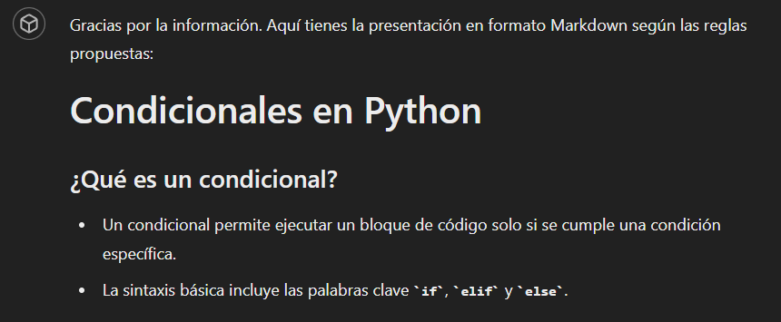
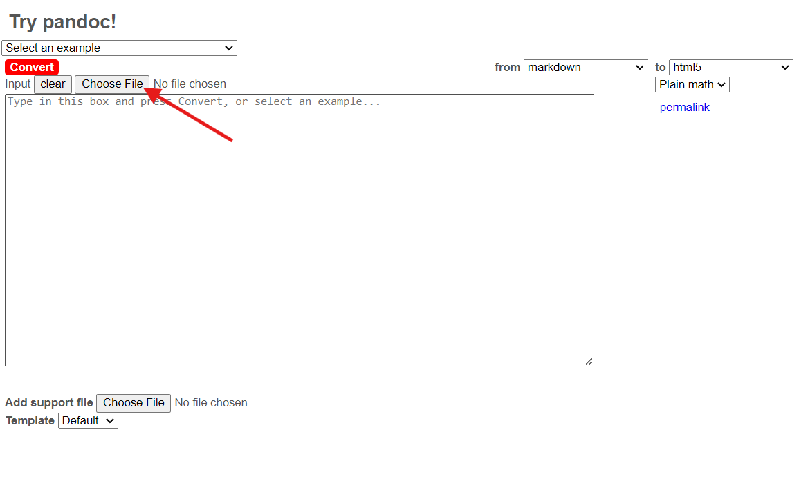
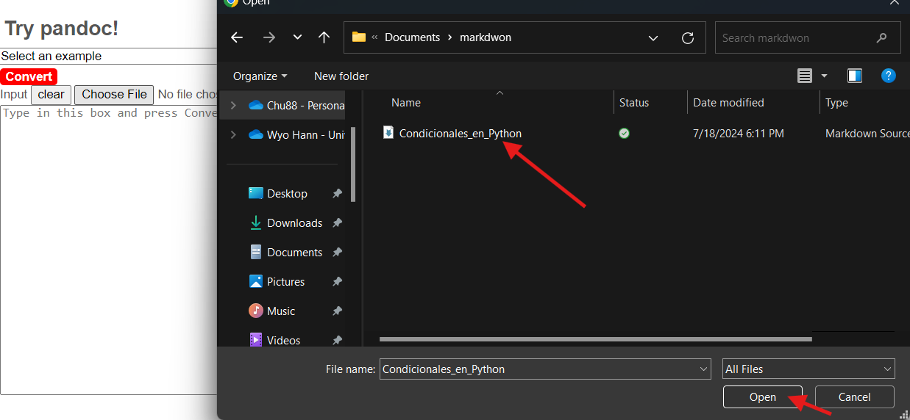
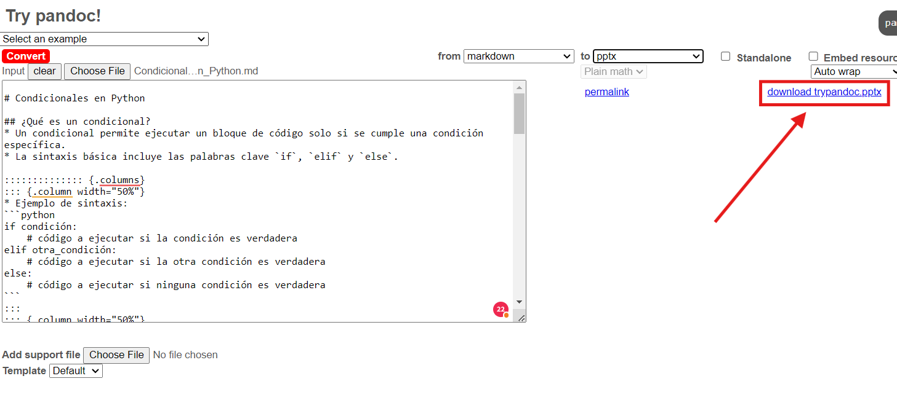
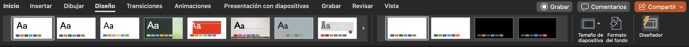

summary: Crear diapositivas de PowerPoint utilizando IA generativa y Pandoc.
id: crear-pptx
categories: IAu,codelab
environments: Web
status: Published
feedback link: https://github.com/ncarvajalc/codelabs-iau/issues
authors: Wyo Hann Chu, Nicolás Carvajal

# Cómo crear diapositivas con IA Generativa y Pandoc

## Introducción
Duration: 01:00

Este tutorial describe cómo crear diapositivas de PowerPoint utilizando IA generativa y Pandoc. Tenemos dos métodos para lograr esto:

1. Usando un GPT para crear diapositivas (se requiere GPT Plus o una suscripción de pago de OpenAI).
2. Usando un prompt de creación de diapositivas en el modelo de su preferencia.

Vamos a desarrollar ambas opciones en este codelab. Siéntase libre de elegir la que mejor se ajuste a sus necesidades. Le recomendamos usar el GPT en caso de que tenga acceso a GPT Plus.

**Recursos:**

* [GPT de creación de diapositivas](https://chatgpt.com/g/g-P3afMY7k1-crear-diapositivas)
* [Pandoc online para generar las diapositivas](https://pandoc.org/try/)

<aside class="negative">
Recuerde que no necesariamente se tendrá en cuenta toda la información que escriba para las diapositivas, y puede que el modelo proponga temas adicionales. La idea es que usted refine el contenido generado por el GPT. Tenga en cuenta que estos modelos generativos pueden cometer errores y es posible que requiera ajustes manuales.
</aside>

## Usando el GPT de diapositivas
Duration: 10:00

Para utilizar el GPT de diapositivas, siga este enlace: [GPT de creación de diapositivas](https://chatgpt.com/g/g-P3afMY7k1-crear-diapositivas).

### Pasos

1. Diríjase al enlace del GPT de creación de diapositivas y seleccione la opción "¡Hola! Quiero crear una presentación para mi curso".


2. Se le preguntará por el tema y objetivo de su presentación. La idea es que detalle lo mejor posible cómo desea desarrollar el contenido de la diapositiva. En este ejemplo, se utiliza el tema de condicionales en Python.


1. Posteriormente, se empezará a generar el contenido de las diapositivas.



4. Una vez generado el contenido, se le preguntará si desea descargar el archivo markdown con el contenido. Responda que sí, y una vez procesado, haga clic en descargar.


<aside class="positive">
Una vez descargado el archivo, puede dirigirse directamente al paso 4 de este codelab.
</aside>

## Usando el prompt para generar las diapositivas
Duration: 5:00

Para empezar, utilice el siguiente prompt:

```console
Eres un experto en creación de presentaciones. Tu tarea es crear unas diapositivas sobre [TEMA] con el objetivo de [OBJETIVO DE LA PRESENTACIÓN]. Cada diapositiva debe seguir las siguientes reglas propuestas por David Philips: “Un mensaje por diapositiva, minimizar el texto para evitar la redundancia, usar el tamaño para enfatizar el contenido importante, emplear el contraste para dirigir la atención y limitar el número de objetos a seis por diapositiva”. Cada diapositiva debe tener un encabezado y utilizar viñetas. Opcionalmente debería poder contener imágenes, pero en lugar de colocar una imagen, debes colocar un placeholder que diga {{COLOCA AQUÍ UNA IMAGEN DE…}}, con la descripción de la imagen que debería ir ahí.
El formato que utilizarás para generar la diapositiva será markdown, utilizando un formato que pueda ser utilizado por Pandoc para convertir de md a pptx. Para ello, te presento las siguientes reglas que se pueden utilizar en Pandoc para crear slides de PowerPoint:

Here is some sample Markdown:

# Section Title
## Slide Title
Text on a slide:
* Bullet
* Bullet
* Bullet
::: notes
Speaker notes go here
:::

That fenced div notation lets you create columns using nested divs without writing <div> tags in HTML. Take a look at this example:

:::::::::::::: {.columns}
::: {.column width="50%"}
Left column:
- Bullet
- Bullet
- Bullet
:::
::: {.column width="50%"}
{{COLOCA AQUÍ UNA IMAGEN DE…}}
:::
::::::::::::::

This produces a left column with another column with an image at the right. Use this when presenting images.

Remember to use line-breaks between different elements using markdown syntax. Specially between bullet points, code blocks, equations, column sections and notes.

Use latex formatted equations in markdown when asked for equations. Here is a block equation:

$$
\int_{a}^{b} f(x) \, dx = F(b) - F(a)
$$

This is an inline equation: $E = mc^2$

Only use this types of equations as rawInline equations cannot be rendered.
```

Reemplace los parámetros *[TEMA]* y *[OBJETIVO DE LA PRESENTACIÓN]* con los datos del contenido que desea para sus diapositivas. Asegúrese de detallar lo más posible cómo desea desarrollar el contenido de las diapositivas.

### Pasos

1. Diríjase a su modelo de IA generativa de confianza, en este caso se usará ChatGPT de OpenAI.


2. Copie el prompt con los valores ya reemplazados, péguelo en el chat y envíelo. En este ejemplo, vamos a crear unas diapositivas sobre condicionales en Python.


3. Posteriormente, se empezará a generar el contenido de las diapositivas.


4. Una vez generado el contenido, solicite la descarga del archivo que contiene las diapositivas.


<aside class="negative">
En caso de que su modelo no permita la descarga de archivos, puede copiar el contenido generado. Posteriormente podrá pegar este contenido en un cuadro de texto para convertirlo en una presentación en formato PPTX.
</aside>

<aside class="positive">
Una vez descargado el archivo, puede dirigirse al siguiente paso de este codelab.
</aside>


## Creación de las diapositivas con Pandoc usando el archivo generado
Duration: 1:00

Ahora, diríjase al sitio de Pandoc para convertir el archivo descargado en una presentación en formato PPTX. Puede acceder al sitio aquí: [Pandoc](https://pandoc.org/try/).

### Pasos

1. Una vez en el sitio de [Pandoc](https://pandoc.org/try/), seleccione la opción *"Choose File"*.

<aside class="negative">
En caso de que su modelo no permita la descarga de archivos, puede copiar el contenido generado y pegarlo en la casilla de texto que encuentra en la parte izquierda de la pantalla de Pandoc. Después de pegar el texto puede continuar con el paso 3.
</aside>



2. Busque en su explorador de archivos el markdown generado anteriormente con el contenido de las diapositivas y selecciónelo. En este caso, se llama "Condicionales_en_Python.md".



3. Una vez cargado el archivo, en la parte superior derecha, seleccione la lista desplegable que dice "to" y elija la opción "pptx".


4. Una vez seleccionada la opción "pptx", seleccione la opción descargar pptx que aparece en pantalla.



5. Una vez descargado el archivo, ya puede abrirlo en PowerPoint o en un editor online de PowerPoint.


*Siéntase en la libertad de modificar las diapositivas a su gusto, añadiendo y corrigiendo la información y formato que considere necesario.*

<aside class="negative">
Las dispositivas generadas no cuentan con imágenes, pero sí con placeholders para que usted pueda añadir las imágenes que considere necesarias. Es su responsabilidad añadir las imágenes que considere pertinentes.
</aside>

## Refinar las diapositivas
Duration: 10:00

Una vez que haya descargado las diapositivas, puede modificarlas a su gusto. Añada imágenes, cambie el formato, añada más contenido o elimine lo que considere necesario. Las diapositivas se crean con un formato básico, por lo que puede personalizarlas según sus necesidades.

En la pestaña superior de PowerPoint, diríjase a la opción "Diseño" para cambiar el diseño de las diapositivas. Puede agregar un tema por defecto o seleccionar un tema personalizado. Le sugerimos consultar la [página de plantillas de presentaciones de PowerPoint](https://create.microsoft.com/en-us/templates/presentations) para obtener más información sobre cómo personalizar sus diapositivas.

Un ejemplo de cómo cambiar el diseño de las diapositivas se muestra a continuación:



## Felicitaciones

¡Felicidades! Ha aprendido cómo crear diapositivas con IA generativa y Pandoc de manera fácil y rápida.
