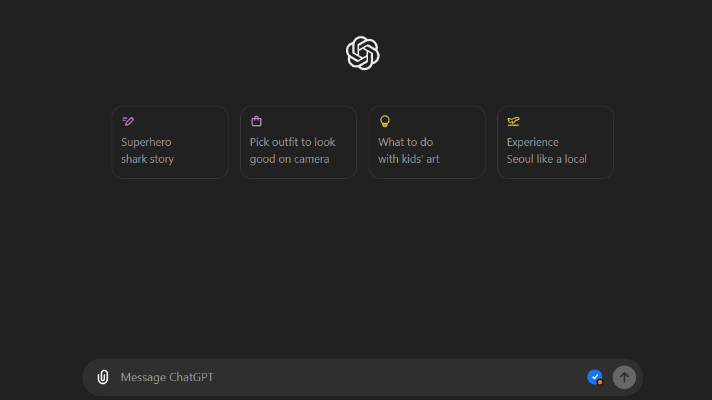
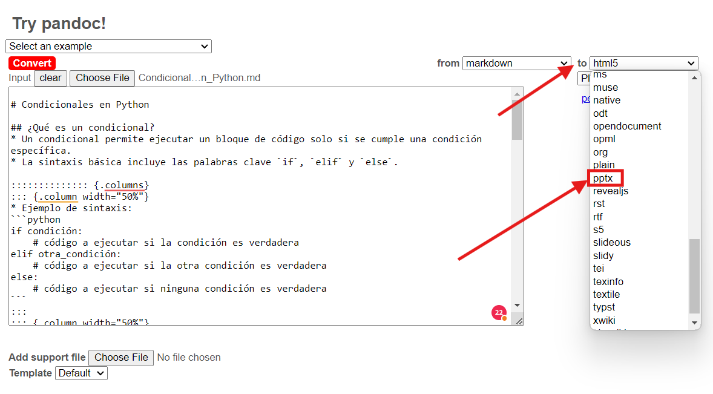
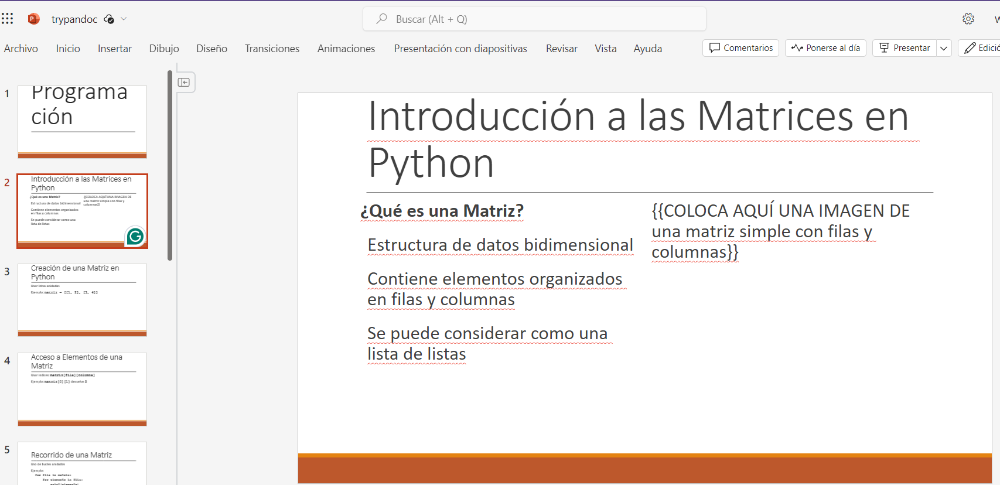

summary: Resumen del codelab
id: crear_pptx
categories: IAu,codelab
environments: Web
status: Published
feedback link: https://github.com/ncarvajalc/codelabs-iau/issues
authors: Wyo Hann Chu

# Cómo crear diapositivas con IA

## Introducción
Duration: 01:00

Este tutorial describe cómo crear diapositivas con IA y Pandoc.

Tenemos dos caminos par hacere esto:

1. Usando el GPT para crear diapositivas (se necesita GPT 4 Plus o una suscripción de pago de Open AI)
1. Usando el prompt en su modelo de preferencia

Vamos a desarrollar ambas opciones en este codelab, sientase libre de elegir la que se ajuste a usted.
Te recomendamos usar el GPT en caso de que tenga GPT 4

**Recursos:**

* Link al GPT de creacion de diapositivas: [Crear Diapositivas](https://chatgpt.com/g/g-P3afMY7k1-crear-diapositivas)
* Link a Pandoc online para generar las diapositivas: [Pandoc](https://pandoc.org/try/)

Nota: Recueda que no necesariamente se van a tener en cuenta toda la información que escriba para las diapositivas, y puede que el modelo proponga temas adicionales. La idea es que usted luego refine el contenido que genere el GPT.

## Usando el GPT de diapositivas
Duration: 10:00

Para el caso de uso del GPT de diapositivas, dirígase con este link: [Crear Diapositivas](https://www.marcd.dev/codelab-4-codelab)

### Pasos

1. Dirigase al link del GPT de Crear Diapositivas y selecciona la opción Hola! Quiero crear una diapositiva para mi curso


2. Se le preguntará por el tema y objetivo de su presentación, aca la idea es que profundice todo lo posible en como quieras desarrollar el contenido de la diapositiva, en este ejemplo se hace el caso de condicionales en Python.


3. Posterior a esto se empezara a generar el contenido de las diapositivas.


4. Una vez generado el contenido, se le preguntará si quiere descargar el markdowon con el contenido, responda que si, y una vez procesado de click en descargar.


*Una vez descargado el archivo, puedes dirigirte directamente al paso 4 de este codelab.*

## Usando el prompt para generar las Diapositivas
Duration: 5:00

Para el caso de uso del prompt de diapositivas, se va a hacer uso del siguiente prompt:

```console
Prompt para generar presentaciones
Eres un experto en creación de presentaciones. Tu tarea es crear unas diapositivas sobre [TEMA] con el objetivo de [OBJETIVO DE LA PRESENTACIÓN]. Cada diapositivas debe seguir las siguiente reglas propuestas por David Philips: “Un mensaje por diapositiva, minimizar el texto para evitar la redundancia, usar el tamaño para enfatizar el contenido importante, emplear el contraste para dirigir la atención y limitar el número de objetos a seis por diapositiva”. Cada diapositiva debe tener un encabezado y utilizar viñetas. Opcionalmente debería poder contener imágenes, pero en lugar de colocar una imagen debes colocar un placeholder que diga {{COLOCA AQUÍ UNA IMAGEN DE…}}, con la descripción de la imagen que debería ir ahí. 
El formato que utilizarás para generar la dispositiva será markdown, utilizando un formato que pueda ser utilizado por pandoc para convertir de md a pptx. Para ello te presento las siguientes reglas que se pueden utilizar en pandoc para crear slides de Powerpoint:


Here is some sample Markdown:

# Section Title
## Slide Title
Text on a slide:
* Bullet
* Bullet
* Bullet
::: notes
Speaker notes go here
:::

That fenced div notation lets you create columns using nested divs without writing <div> tags in HTML. Take a look at this example:

:::::::::::::: {.columns}
::: {.column width="50%"}
Left column:
- Bullet
- Bullet
- Bullet
:::
::: {.column width="50%"}
{{COLOCA AQUÍ UNA IMAGEN DE…}}
:::
::::::::::::::

This produces a left column with another column with an image at the right


```
La idea es que reemplaze los parametros *[TEMA]* y *[OBJETIVO DE LA PRESENTACIÓN]* con los datos de los que usted quiere hacer sus diapositivas. Acá la idea es que profundice todo lo posible en como quiera desarrollar el contenido de la diapositiva, tal que tenga claros los temas que va a abordar.

### Pasos


1. Dirigase a IA de confianza, en este caso se usará ChatGPT de OpenAI





2. Copie el prompt con los valores ya reemplazados, copielo en el chat y envíelo, en este caso, vamos a crear unas dispositivas con el contenido de condicionales para el lenguaje de programación Python.


3. Posterior a esto se empezara a generar el contenido de las diapositivas.


4. Una vez generado el contenido, solicita que se proporcione la descarga del archivo que contiene las diapositivas.


*Una vez descargado el archivo, puedes dirigirte al siguiente paso de este codelab.*
## Creación de las diapositivas con Pandoc usando el archivo generado
Duration: 1:00

Ahora nos dirigimos al sitio de Pandoc, para convertir el archivo que descargamos en una presentación en formato PPTX.
Puede acceder al sitio aquí: [Pandoc](https://pandoc.org/try/)

### Pasos:

1. Una vez en el sitio [Pandoc](https://pandoc.org/try/), seleccionamos en la opcion *"Choose File"*


2. Buscamos en nuestro explorador de archivos el markdown generado anteriormente con el contenido de las diapositivas y lo seleccionamos, en este caso se llama "Condicionales_en_Python.md"


3. Una vez cargado el archivo, en la parte superior derecha seleccionamos la lista desplegable que dice "to", y elegimos la opción "pptx"



4. Una vez seleccionada la opción "pptx", seleccione la opción descargar pptx que aparece ahora en pantalla.


5. Una vez descargado el archivo, ya podemos abrirlo en PowerPoint o en un editor online de PowerPoint.



*Sientase en la libertad ahora de modificar las diapositivas a su gusto, añadiendo y corriegiendo la información y formato que vea necesario*

## Felicitaciones

¡Felicidades! Has aprendido cómo crear diapositivas con IA y pandoc de una manera fácil y rápida.