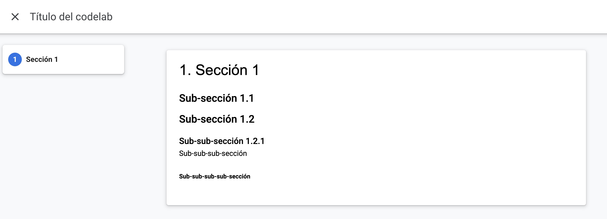

summary: Resumen del codelab
id: example-markdown
categories: IAu,codelab
environments: Web
status: Published
feedback link: https://github.com/ncarvajalc/codelabs-iau/issues
authors: Nombre(s) autor(es)

# Codelab de cómo crear un codelab usando Markdown

## Introducción
Duration: 01:00

Este tutorial describe cómo crear un codelab usando Markdown. Va a explicar la sintaxis de Markdown y cómo usarla para crear un codelab.

Un codelab puede crearse de varias maneras:

1. Usando un Google Docs
1. Usando un archivo Markdown

En este codelab vamos a usar la segunda opción y crear nuestro codelab usando un archivo Markdown. Esto nos da la flexibilidad de usar nuestro archivo Markdown para otras cosas y también almacenarlo en nuestro repositorio de GitHub con cualquier código que pueda ser usado para un tutorial.

**Recursos:**

* Este codelab está basado en el siguiente codelab: [Enlace al Codelab](https://www.marcd.dev/codelab-4-codelab)
* El Markdown con el código fuente que genera este codelab se puede encontrar aquí: [example.md](https://github.com/ncarvajalc/codelabs-iau/blob/main/markdown/example/example.md)
* [Google CodeLabs Tools Github](https://github.com/googlecodelabs/tools) - El repositorio que contiene la herramienta claat que se usa para crear codelabs
* [Google Group for codelab Authors](https://groups.google.com/forum/#!forum/codelab-authors) - foro para hacer preguntas sobre codelabs y discutir funcionalidades futuras

## Configuración del entorno de trabajo
Duration: 10:00

Para la iniciativa de IAu, vamos a usar la herramienta **claat** de Google para crear codelabs. Esta se obtendrá a partir del repositorio donde vamos a alojar todos los codelabs. Puede acceder al repositorio [aquí](https://github.com/ncarvajalc/codelabs-iau/).

### Pre-requisitos

* Tener una cuenta de GitHub
* Tener git instalado en tu máquina
* Conocimientos básicos de git
* Git Bash (para Windows)

### Pasos

1. Clona el repositorio de codelabs en tu máquina local

    ```console
    git clone https://github.com/ncarvajalc/codelabs-iau/
    ```

2. Abre una terminal y navega a la carpeta raíz del repositorio

    ```console
    cd codelabs-iau
    ```

3. Verifica que la herramienta **claat** está funcionando.

#### Configuración en Mac

```console
claat/bin/claat-mac help
```

#### Configuración en Linux

```console
claat/bin/claat-linux-x86 help
```

#### Configuración en Windows

```console
claat\bin\claat-windows-x86.exe help
```

Una vez que hayas verificado que la herramienta **claat** está funcionando, puedes continuar con el siguiente paso.

## Creación de un nuevo codelab
Duration: 5:00

Para crear un nuevo codelab, necesitas crear una carpeta con un archivo Markdown en la carpeta `markdown` del repositorio. Puedes copiar uno de las carpetas existentes y modificarlo para tu codelab. La carpeta debe tener un nombre único que describa el contenido del codelab y debe coincidir con el `id` en los metadatos del codelab. Por ejemplo, si el `id` de tu codelab es `nombre-url-codelab`, entonces la carpeta debe llamarse `nombre-url-codelab`.

En caso de que uses imágenes en tu codelab, debes colocarlas en la carpeta `img` dentro de la carpeta de tu codelab. Por ejemplo, si tu codelab se llama `nombre-url-codelab`, entonces las imágenes deben estar en la carpeta `nombre-url-codelab/img`.

Una vez que hayas creado tu codelab, puedes empezar a utilizar Markdown para escribir el contenido del codelab como se describe a continuación.

Para generar el codelab, debes ejecutar el siguiente comando:

### Generación de codelabs con markdown

#### Generación en Mac

```console
claat/bin/claat-mac export -o codelabs <ruta_markdown>.md
```

#### Generación en Linux

```console
claat/bin/claat-linux-x86 export -o codelabs <ruta_markdown>.md
```

#### Generación en Windows

```console
claat\bin\claat-windows-x86.exe export -o codelabs <ruta_markdown>.md
```

Donde `ruta_markdown` es la ruta del codelab en formato markdown.

### Probar el codelab

Una vez que hayas generado el codelab, puedes probarlo haciendo uso del siguiente comando:

#### Probar en Mac

```console
claat/bin/claat-mac serve
```

#### Probar en Linux

```console
claat/bin/claat-linux-x86 serve
```

#### Probar en Windows

```console
claat\bin\claat-windows-x86.exe serve
```

Desde tu navegador, puedes acceder al codelab en la siguiente dirección: `http://localhost:9090/codelabs/nombre-url-codelab`.

Donde `nombre-url-codelab` es el nombre de la carpeta de tu codelab.

## Metadatos del codelab
Duration: 1:00

Antes de empezar a escribir tu codelab, es importante añadir metadatos al principio de tu archivo Markdown. Estos metadatos son necesarios para que la herramienta **claat** pueda generar el codelab correctamente.

### Metadatos

Copia y pega los metadatos de abajo en tu archivo Markdown y cambia los valores apropiadamente. Las directrices están disponibles debajo de los metadatos de muestra.

```console
summary: Resumen del codelab
id: nombre-url-codelab
categories: IAu,codelab
environments: Web
status: Published
feedback link: https://github.com/ncarvajalc/codelabs-iau/issues
authors: Nombre(s) autor(es)
```

* **summary**: Un resumen de lo que trata el codelab.
* **id**: Un identificador único para el codelab. Debe ser un nombre que describa el contenido del codelab y será el nombre de la URL donde se alojará el codelab.
* **categories**: Una lista separada por comas de las categorías a las que pertenece el codelab.
* **environments**: Una lista de entornos en los que el codelab debería ser descubierto. Los codelabs marcados como "Web" serán visibles en el índice de codelabs. Los codelabs marcados como "Kiosco" sólo estarán disponibles en los kioscos de codelabs, que tienen equipo especial adjunto. En nuestro caso, usaremos "Web" la mayoría de las veces.
* **status**: El estado de publicación del codelab. En nuestro caso, usaremos "Published".
* **feedback link**: Un enlace donde los usuarios pueden ir para proporcionar retroalimentación sobre el codelab. En nuestro caso, usaremos el enlace al repositorio de GitHub.
* **authors**: El nombre del autor o autores del codelab.

## Tabla de contenidos
Duration: 1:00

Todo codelab cuenta con una tabla de contenidos que permite a los usuarios navegar por el contenido del codelab. La tabla de contenidos se genera automáticamente a partir de los encabezados de nivel 2 en tu archivo Markdown.

Por ejemplo, si tienes los siguientes encabezados en tu archivo Markdown:

```console
## Sección 1
## Sección 2
## Sección 3
```

Entonces tu tabla de contenidos se verá así:


## Encabezados
Duration: 2:00

Los encabezados en Markdown se crean usando el símbolo `#`. El número de `#` indica el nivel del encabezado. Por ejemplo, un encabezado de nivel 1 se crea con un solo `#`, un encabezado de nivel 2 se crea con dos `#`, y así sucesivamente.

En el caso de los codelabs, los encabezados de nivel 1 se usan para el título del codelab, los encabezados de nivel 2 se usan para las secciones del codelab y los encabezados de nivel 3 para arriba se usan para las sub-secciones.

Por ejemplo, si tienes la siguiente estructura de encabezados en tu archivo Markdown:

```console
# Título del codelab
## Sección 1
### Sub-sección 1.1
### Sub-sección 1.2
#### Sub-sub-sección 1.2.1
##### Sub-sub-sub-sección
###### Sub-sub-sub-sub-sección
```

Entonces tu codelab se verá así:



Para los encabezados de nivel 2, tienes la opción de añadir una duración al final del encabezado. Esto se hace añadiendo `Duration: hh:mm:ss` o `Duration: mm:ss` al final del encabezado. Esto le dice a los usuarios cuánto tiempo se tarda en completar esa sección del codelab. Por ejemplo:

```console
## Sección 1
Duration: 10:00
```

Así se verá en el codelab cuando se esté en la sección 1:


## Estilos de texto
Duration: 3:00

Markdown soporta varios estilos de texto que puedes usar para dar formato a tu codelab. Algunos de los estilos de texto más comunes son:

* **Negrita**: Se crea poniendo el texto entre dos asteriscos `**` o dos guiones bajos `__`. Por ejemplo, `**negrita**` o `__negrita__`.
* *Cursiva*: Se crea poniendo el texto entre un asterisco `*` o un guion bajo `_`. Por ejemplo, `*cursiva*` o `_cursiva_`.
* `Código in-line`: Se crea poniendo el texto entre dos acentos graves `` ` ``. Por ejemplo, `` `código` ``.

Por ejemplo, si tienes el siguiente texto en tu archivo Markdown:

```console
**Este texto está en negrita**

*Este texto está en cursiva*

`Este texto es código`
```

Entonces tu codelab se verá así:


## Listas
Duration: 3:00

Markdown soporta varios tipos de listas que puedes usar para organizar tu contenido. Algunos de los tipos de listas más comunes son:

* **Listas ordenadas**: Se crean poniendo un número seguido de un punto. Por ejemplo, `1. Elemento 1`, `2. Elemento 2`, etc.
* **Listas no ordenadas**: Se crean poniendo un guion `-`, o un asterisco `*` . Por ejemplo, `- Elemento 1`, `* Elemento 2`.
* **Listas anidadas**: Puedes anidar listas poniendo cuatro espacios antes del guion, asterisco o signo más. Por ejemplo:

```console
- Elemento 1
  - Elemento 1.1
  - Elemento 1.2
- Elemento 2
  - Elemento 2.1
  - Elemento 2.2
```

Por ejemplo, si tienes el siguiente texto en tu archivo Markdown:

```console
1. Elemento 1
2. Elemento 2
3. Elemento 3

- Elemento 1
  - Elemento 1.1
  - Elemento 1.2
- Elemento 2
  - Elemento 2.1
  - Elemento 2.2
- Elemento 3
  - Elemento 3.1
  - Elemento 3.2
```

Entonces tu codelab se verá así:


## Imágenes 
Duration: 3:00

Puedes añadir imágenes a tu codelab usando la siguiente sintaxis:

```console

```

Todas las imágenes que utilizas deben colocarse

Por ejemplo, si tienes el siguiente texto en tu archivo Markdown y la imagen `gato.jpg` en la carpeta `img` de tu codelab:

```console

```

Entonces se insertará la siguiente imagen en tu codelab:


## Videos de YouTube
Duration: 3:00

Puedes añadir videos de YouTube a tu codelab usando la siguiente sintaxis:

```html
<video id="ID_VIDEO"></video>
```

Donde `ID_VIDEO` es el ID del video de YouTube que quieres insertar. Por ejemplo, si el enlace al video de YouTube es `https://www.youtube.com/watch?v=dQw4w9WgXcQ`, entonces el ID del video es `dQw4w9WgXcQ`.

Por ejemplo, si tienes el siguiente texto en tu archivo Markdown:

```html
<video id="dQw4w9WgXcQ"></video>
```

Entonces se insertará el siguiente video en tu codelab:

<video id="dQw4w9WgXcQ"></video>

## Enlaces externos
Duration: 2:00

Puedes añadir enlaces a tu codelab usando la siguiente sintaxis:

```console
[Texto del enlace](URL)
```

Por ejemplo, si tienes el siguiente texto en tu archivo Markdown:

```console
[Google](https://www.google.com)
```

Entonces se insertará el siguiente enlace en tu codelab: [Google](https://www.google.com)

## Fragmentos de línea de comandos
Duration: 3:00

<aside class="negative">
Tenga presente que los acentos graves no se ven bien en el codelab, por lo que se han reemplazado por `｀`. En su caso, debe hacer uso de los acentos graves o backticks para que el comando se vea correctamente.
</aside>

Puedes añadir fragmentos de línea de comandos a tu codelab usando la siguiente sintaxis:

```console
｀｀｀console
comando
｀｀｀
```

Por ejemplo, si tienes el siguiente texto en tu archivo Markdown:

```console
｀｀｀console
Ejemplo de fragmento de línea de comandos
｀｀｀
```

Entonces se insertará el siguiente fragmento de línea de comandos en tu codelab:

```console
Ejemplo de fragmento de línea de comandos
```

## Fragmento de código
Duration: 3:00

<aside class="negative">
Tenga presente que los acentos graves no se ven bien en el codelab, por lo que se han reemplazado por `｀`. En su caso, debe hacer uso de los acentos graves o backticks para que el comando se vea correctamente.
</aside>

Puedes añadir fragmentos de código a tu codelab usando la siguiente sintaxis:

```console
｀｀｀lenguaje
código
｀｀｀
```

Por ejemplo, si tienes el siguiente texto en tu archivo Markdown:

```console
｀｀｀python
def hola_mundo():
    print("Hola, mundo!")
｀｀｀
```

Entonces se insertará el siguiente fragmento de código en tu codelab:

```python
def hola_mundo():
    print("Hola, mundo!")
```

## Cuadros de información
Duration: 2:00

Puedes añadir cuadros de información a tu codelab usando la siguiente sintaxis:

```xml
<aside class="positive">
Texto del cuadro de información
</aside>
```

Existen 2 tipos de cuadros de información:

* **positive**: Se usa para resaltar información importante o positiva.
* **negative**: Se usa para resaltar información importante o negativa.

Por ejemplo, si tienes el siguiente texto en tu archivo Markdown:

```xml
<aside class="positive">
Este es un cuadro de información positiva
</aside>

<aside class="negative">
Este es un cuadro de información negativa
</aside>
```

Entonces se insertarán los siguientes cuadros de información en tu codelab:

<aside class="positive">
Este es un cuadro de información positiva
</aside>

<aside class="negative">
Este es un cuadro de información negativa
</aside>

## Botón de descarga
Duration: 1:00

Puedes añadir un botón de descarga a tu codelab usando la siguiente sintaxis:

```xml
<button>[Texto del botón](URL)</button>
```

Por ejemplo, si tienes el siguiente texto en tu archivo Markdown:

```xml
<button>[Código fuente repositorio](https://github.com/ncarvajalc/codelabs-iau)</button>
```

Entonces se insertará el siguiente botón de descarga en tu codelab:

<button>[Código fuente repositorio](https://github.com/ncarvajalc/codelabs-iau)</button>

## Publicar el codelab

Una vez que hayas terminado de escribir tu codelab, puedes publicarlo en la web para que otros puedan acceder a él. Para hacer esto, debes subir el codelab a un servidor web o a un repositorio de GitHub y compartir el enlace con otros.

En el caso de IAu vamos a hacer uso de GitHub Pages, que nos permite alojar sitios web estáticos de forma gratuita.

El repositorio se configuró para que cada vez que se haga un push a la rama `main`, se actualice el sitio web de GitHub Pages. Es importante que el codelab esté en la carpeta `codelabs` del repositorio para que se genere correctamente.

Una vez que hayas subido tu codelab a GitHub, puedes compartir el enlace con otros para que puedan acceder a él.

### Pull request

Para poder publicar tu codelab, debes hacer un pull request al repositorio `ncarvajalc/codelabs-iau` con los cambios que has hecho. Una vez que el pull request sea aprobado y se haya fusionado con la rama `main`, tu codelab estará disponible en la web.

<aside class="positive">
El enlace al codelab se generará automáticamente a partir del `id` del codelab. Por ejemplo, si el `id` de tu codelab es `nombre-url-codelab`, entonces el enlace al codelab será `https://ncarvajalc.github.io/codelabs-iau/codelabs/nombre-url-codelab`.
</aside>


## Felicitaciones

¡Felicidades! Has aprendido cómo crear un codelab usando Markdown. Ahora puedes empezar a escribir tu propio codelab y compartirlo con otros.
